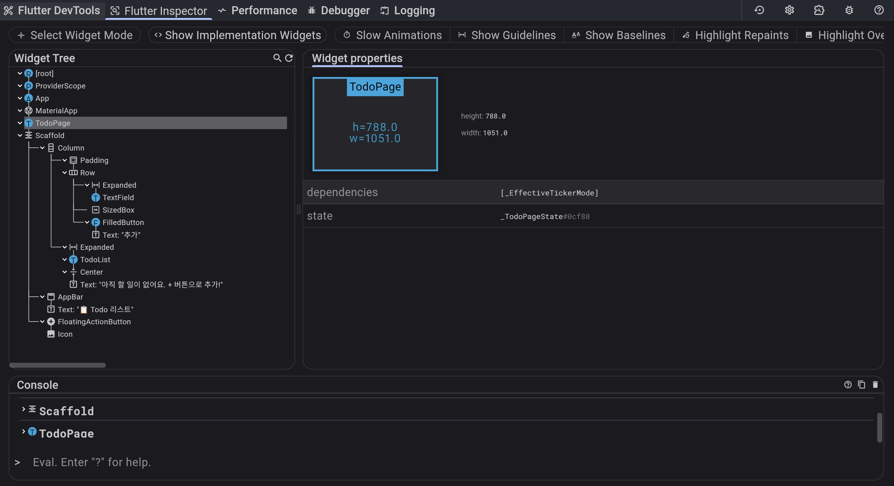
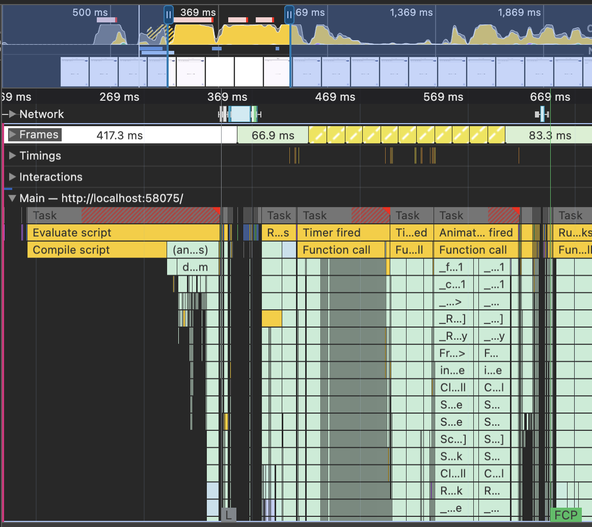
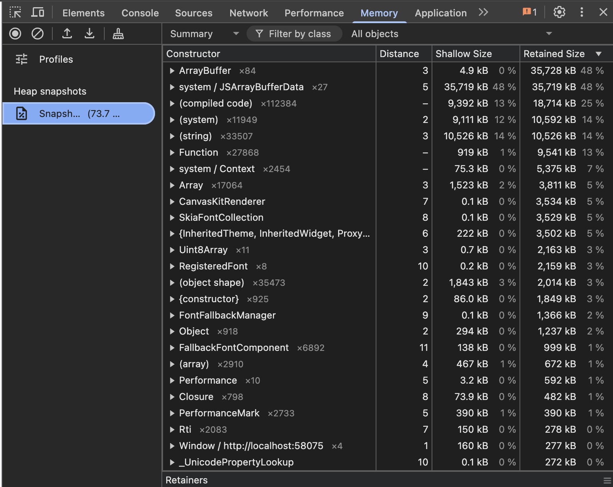
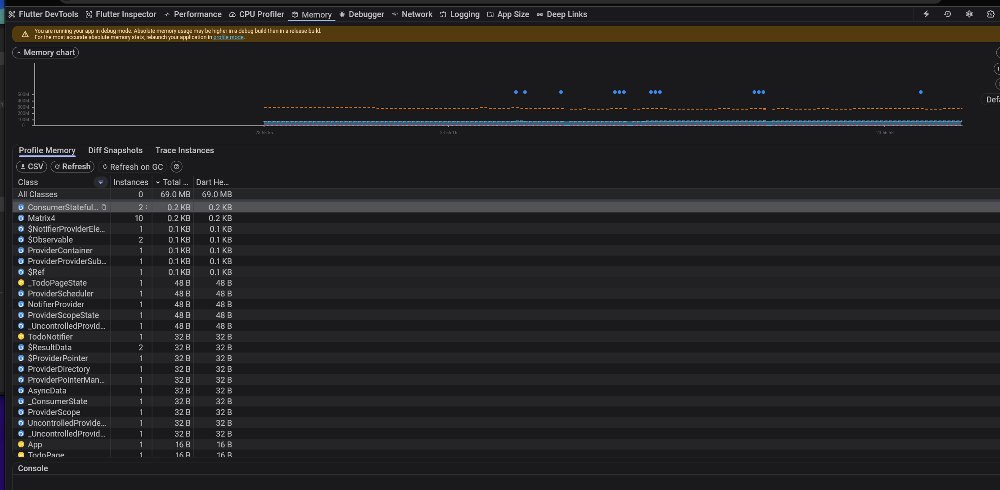
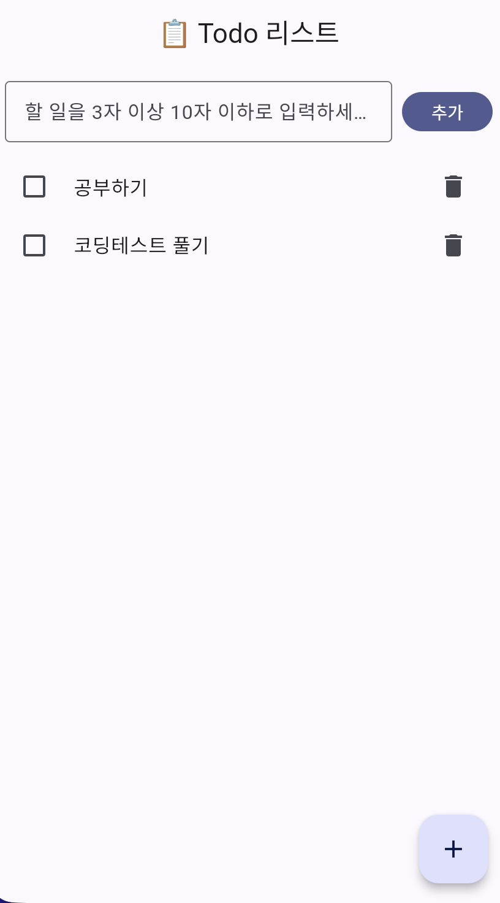
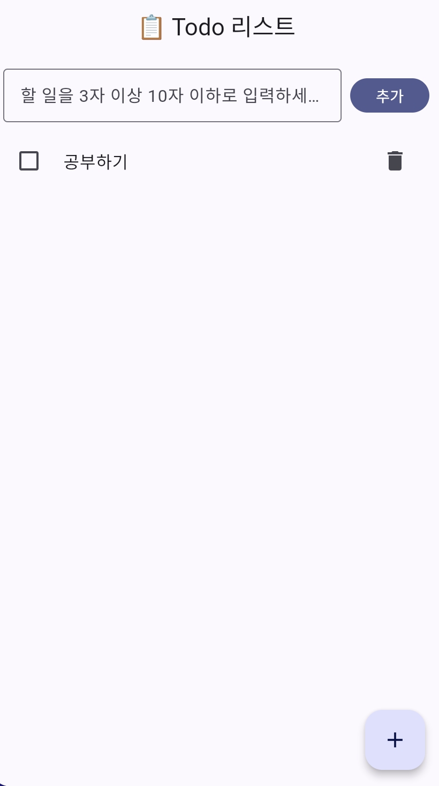

# 📋 Flutter TODO 앱

Flutter와 Riverpod을 사용하여 구현한 할 일 관리 애플리케이션입니다.

[기술 블로그에 올린 글](https://rmdnps10.github.io/Flutter%EC%97%90%EC%84%9C%20Riverpods%20%EC%9E%98%20%EC%82%AC%EC%9A%A9%ED%95%98%EA%B8%B0/)

## 🚀 빌드 및 실행 방법

### 사전 요구사항

- Flutter SDK
- Dart SDK
- VS Code

### 실행 명령어

```bash
# 의존성 설치
flutter pub get

# 앱 실행 (디버그 모드)
flutter run

# 앱 빌드 (릴리즈 모드)
flutter build apk
flutter build ios
flutter build web
```

### DevTools 실행

```bash
# Flutter DevTools 실행
flutter pub global activate devtools
dart devtools

```

## 🏗️ 프로젝트 구조

```
lib/
├── main.dart                    # 앱 진입점
├── app.dart                     # 앱 설정
├── models/
│   └── todo.dart               # Todo 데이터 모델
├── providers/
│   └── todo_providers.dart     # Riverpod 상태 관리
├── validators/
│   └── todo_validator.dart     # 입력 유효성 검사
└── views/
    ├── todo_page.dart          # 메인 페이지
    └── widgets/
        ├── todo_item.dart      # 개별 할 일 위젯
        └── todo_list.dart      # 할 일 목록 위젯
```

## 🔧 구현 상세

### 사용한 주요 위젯

#### 1. **ConsumerStatefulWidget & ConsumerWidget**

- **TodoPage**: `ConsumerStatefulWidget` 사용
  - `TextEditingController`로 입력 관리
  - 유효성 검사 상태 관리
- **TodoItem**: `ConsumerWidget` 사용
  - 간단한 상태 없는 위젯으로 구현

#### 2. **UI 위젯들**

- **Scaffold**: 앱의 기본 레이아웃 구조
- **AppBar**: 상단 앱바 ("📋 Todo 리스트")
- **Column & Row**: 수직/수평 레이아웃
- **TextField**: 할 일 입력 필드
  - `maxLength: 10`으로 입력 제한
  - 실시간 에러 메시지 표시
- **ListTile**: 할 일 항목 표시
  - `leading`: 체크박스
  - `title`: 할 일 텍스트 (완료 시 취소선)
  - `trailing`: 삭제 버튼
- **Checkbox**: 완료 상태 토글
- **IconButton**: 삭제 기능
- **FloatingActionButton**: 빠른 추가 버튼

### 상태 관리 구조

#### **데이터 모델**

```dart
class Todo {
  final String id;          // 고유 식별자
  final String title;       // 할 일 제목
  final bool isDone;        // 완료 상태

  // 불변 객체를 위한 copyWith 메서드
  Todo copyWith({String? id, String? title, bool? isDone});
}
```

#### **상태 관리 (Riverpod)**

```dart
class TodoNotifier extends Notifier<List<Todo>> {
  List<Todo> build() => [];                    // 초기 상태: 빈 리스트
  void add(String title);                      // 할 일 추가
  void toggle(String id);                      // 완료 상태 토글
  void remove(String id);                      // 할 일 삭제
}
```

#### **데이터 플로우**

```
사용자 입력 → TodoValidator → TodoNotifier → UI 업데이트
     ↑                                            ↓
     └─────────── ref.read() ←─────────────────────┘
```

### 유효성 검사 로직

#### **분리된 Validator 클래스**

```dart
class TodoValidator {
  static const int minLength = 3;    // 최소 3자
  static const int maxLength = 10;   // 최대 10자

  static String? validateTitle(String? title) {
    // null 체크, 길이 검사, 에러 메시지 반환
  }
}
```

#### **검사 규칙**

- ✅ 3자 이상 10자 이하
- ✅ 빈 문자열 불허
- ✅ 에러 메시지 노출

## 🌟 Bonus Points

### 1. **Riverpod 상태 관리**

#### **구현 세부사항**

```dart
// Provider 정의
final todoListProvider = NotifierProvider<TodoNotifier, List<Todo>>(
  TodoNotifier.new,
);

// 상태 구독 (watch)
final todos = ref.watch(todoListProvider);

// 상태 변경 (read)
ref.read(todoListProvider.notifier).add(text);
```

#### **불변 상태 관리**

```dart

// ✅ 올바른 방법 (새로운 리스트 생성)
state = [...state, newTodo];
```

### 2. **Flutter DevTools 활용**

### Inspector



### Timeline, performance

- Chrome (Web에서 실행)


- Flutter Devtools (Android로 실행)



### Memory

- Chrome (Web에서 실행)



- Flutter Devtools (Android로 실행)



### 3. **추가 구현 사항**

#### **관심사 분리 (Separation of Concerns)**

- **Model**: 데이터 구조 정의
- **Provider**: 비즈니스 로직 및 상태 관리
- **Validator**: 입력 유효성 검사
- **View**: UI 렌더링

#### **에러 처리**

- 입력 제한으로 예방적 에러 방지

#### **사용자 경험 (UX)**

- 직관적인 UI (체크박스, 취소선)
- 즉시 피드백 (에러 메시지)
- 편리한 입력 방식 (Enter 키, FAB)

## 📱 주요 기능

- ✅ 할 일 추가 (3-10자 제한)
- ✅ 할 일 완료/미완료 토글
- ✅ 할 일 삭제
- ✅ 완료된 할 일 시각적 표시 (취소선)

## 🛠️ 기술 스택

- **Flutter**: UI 프레임워크
- **Dart**: 프로그래밍 언어
- **Riverpod**: 상태 관리
- **Material Design**: UI 디자인 시스템
- **Flutter DevTools**: 개발 및 디버깅 도구

## 리스트 추가, 삭제, 완료 스크린샷


| 리스트 추가 | 리스트 완료 | 리스트 삭제 
|---| --|--|
| |   |  |

